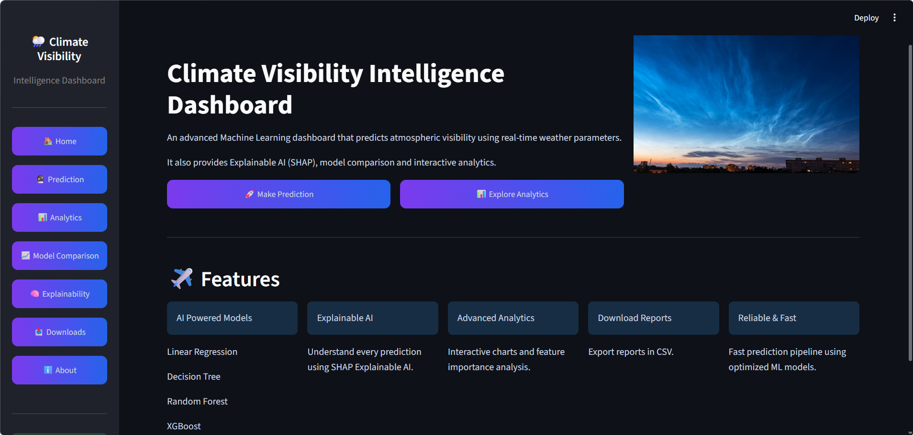
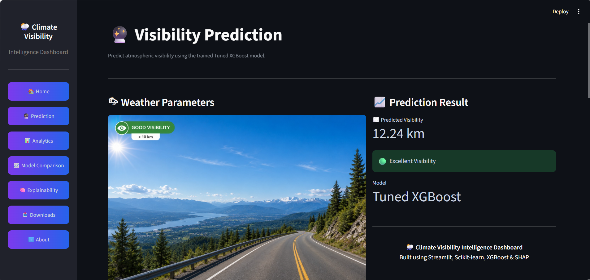
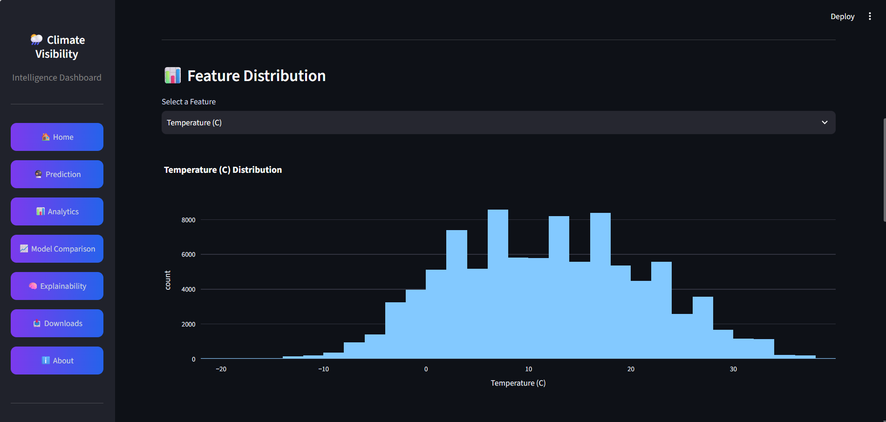
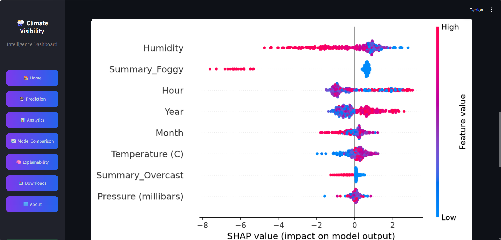
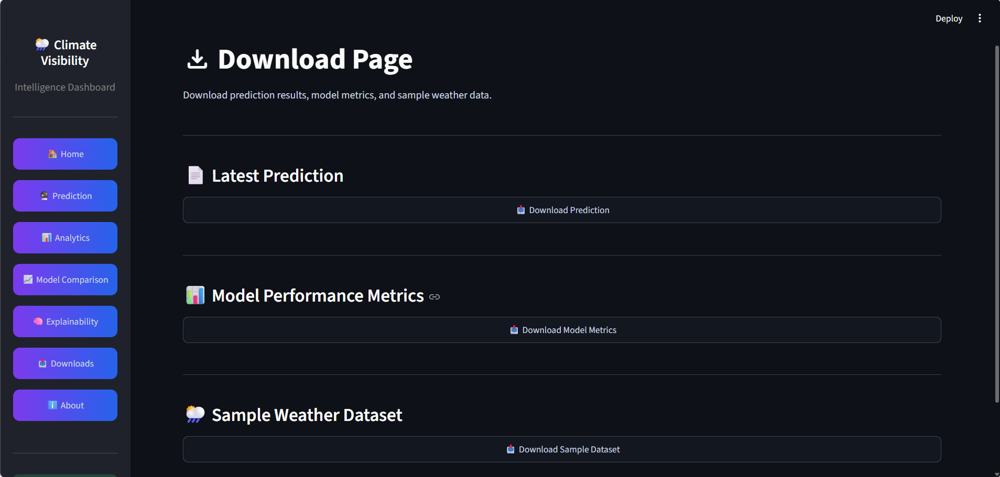
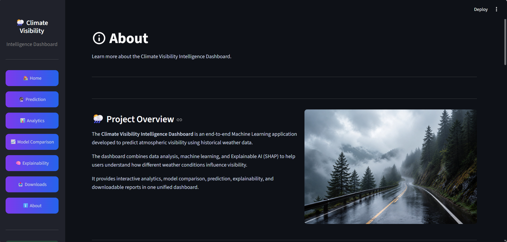

# 🌦️ Climate Visibility Intelligence Dashboard

<p align="center">


</p>

---

## 🌍 Overview

The **Climate Visibility Intelligence Dashboard** is an end-to-end Machine Learning application that predicts atmospheric visibility using weather parameters.

The dashboard combines **Machine Learning**, **Interactive Analytics**, and **Explainable AI (SHAP)** into a single Streamlit application.

It allows users to

- 🔮 Predict atmospheric visibility
- 📊 Explore historical weather data
- 🤖 Compare multiple ML models
- 🧠 Understand model predictions using SHAP
- 📥 Download reports and datasets

---

# 🚀 Live Demo

> **Coming Soon**

Deployment will be available after publishing on Streamlit Cloud.

---

# 📸 Dashboard Preview

## 🏠 Home



---

## 🔮 Prediction



---

## 📊 Analytics



---

## 🧠 Explainability (SHAP)



---

## 📥 Downloads



---

## ℹ️ About



---

# ✨ Features

- 🌦️ Weather Visibility Prediction
- 📈 Interactive Analytics Dashboard
- 🧠 Explainable AI using SHAP
- 📊 Model Performance Comparison
- 📥 CSV Download Support
- 📂 Sample Dataset Download
- 🎨 Modern Dark Dashboard UI
- ⚡ Fast Predictions using Tuned XGBoost

---

# 🛠️ Technology Stack

| Category | Technologies |
|-----------|-------------|
| Frontend | Streamlit |
| Backend | Python |
| Machine Learning | Scikit-learn, XGBoost |
| Explainability | SHAP |
| Visualization | Plotly, Matplotlib |
| Data Processing | Pandas, NumPy |
| Model Saving | Joblib |

---

# 🤖 Machine Learning Models

The following regression models were trained and evaluated.

- Linear Regression
- Decision Tree Regressor
- Random Forest Regressor
- Baseline XGBoost
- ⭐ Tuned XGBoost (Best Model)

---

# 📊 Model Performance

| Model | MAE | RMSE | R² Score |
|------|------|------|------|
| Linear Regression | 2.4960 | 3.0290 | 0.4813 |
| Decision Tree | 1.5368 | 2.2878 | 0.7041 |
| Random Forest | 1.1873 | 1.8434 | 0.8079 |
| Baseline XGBoost | 1.4365 | 2.0404 | 0.7646 |
| ⭐ Tuned XGBoost | **1.1977** | **1.7759** | **0.8217** |

---

# 🧠 Explainable AI

The project integrates **SHAP (SHapley Additive exPlanations)** to explain model predictions.

The Explainability Dashboard includes

- Global Feature Importance
- SHAP Summary Plot
- Feature Contribution Analysis

This enables users to understand **why** the model predicts a particular visibility value instead of treating it as a black box.

---

# 📂 Project Structure

```text
Climate-Visibility-Intelligence
│
├── assets/
├── components/
├── data/
├── notebooks/
├── pages/
├── src/
├── styles/
│
├── main.py
├── requirements.txt
├── README.md
└── .gitignore
```

---

# ⚙️ Installation

Clone the repository

```bash
git clone https://github.com/TanmoyDas1724/Climate-Visibility-Intelligence.git
```

Move into the project

```bash
cd Climate-Visibility-Intelligence
```

Install dependencies

```bash
pip install -r requirements.txt
```

Run the application

```bash
streamlit run main.py
```

---

# 📁 Dataset

**Weather History Dataset**

Target Variable

```
Visibility (km)
```

Features include

- Temperature
- Apparent Temperature
- Humidity
- Pressure
- Wind Speed
- Wind Bearing
- Summary
- Precipitation Type
- Date-Time Features

---

# 🎯 Project Objectives

- Predict atmospheric visibility using weather parameters.
- Compare multiple regression models.
- Explain predictions using SHAP.
- Explore historical weather data.
- Build a complete Machine Learning dashboard.

---

# 🚀 Future Improvements

- Live Weather API Integration
- Real-Time Prediction
- Weather Forecast Support
- Mobile Responsive Layout
- Cloud Deployment
- User Authentication
- Docker Support

---

# 👨‍💻 Developer

## Tanmoy Das

**GitHub**

https://github.com/TanmoyDas1724

**LinkedIn**

https://www.linkedin.com/in/tanmoy-das-719379314/

---

# ⭐ If you found this project useful

Please consider giving the repository a **Star ⭐**

It motivates me to build more Machine Learning projects.

---

<p align="center">

**Climate Visibility Intelligence Dashboard**

Built with ❤️ using Streamlit, Scikit-learn, XGBoost & SHAP

</p>
